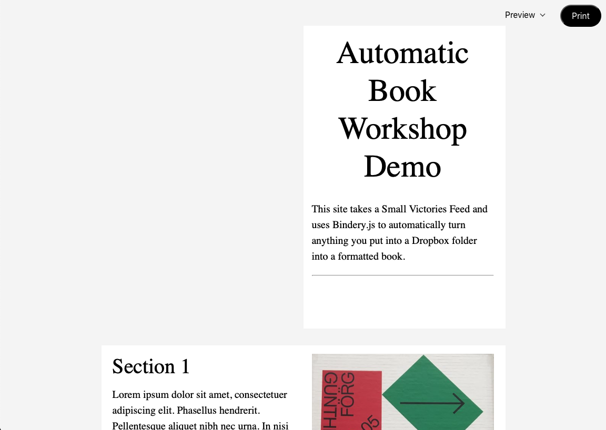

## Contents

1. Introduction
2. Provocation
2. Tools & Resources
3. Set-up
3. Appendix (projects)
3. Impressum

## Introduction

We think of a book as a static object. Once it’s been printed, that’s it (until perhaps a new edition is released). The content cannot change, the form wil alwasy remain as originally intended, and it is intrinsically scarce. Because of that, the process of making it must follow a certain procedure: we produce the content that will go inside it, format this content into the design of the book, print, and bind it all together. The book is a finished state.

The internet (by way of its artifacts, websites) works very differently: we maybe start with the form, and let the content  flow into it. The design may adapt or even break to match a growing or at least changing set of inputs. There is no finished state.

This workshop explores what happens when you combine finished and unfinished states to create a snapshot in time.

## Provocation

Books are a wonderful format because their form (the best ones, anyway) can respond to their subject. The book can be crafted around the story and become another layer in telling that story. In addition, they travel well, don’t run out of batteries, and by their very design tell you how much there is to read and how much you’ve got left.

A website has a harder time doing this because often the rules are written before the story is told. Rules-based design has its own benefits though: once properly set up, we have to do very little.

What would a book be like if:

- Its meaning is amplified by its form, that is portable, always up-to-date, and never out of print?
- It can by customized by the person reading it?
- It is different today than it will be tomorrow?
- It is different for my than it is for you?

## Tools & Resources

No specialized coding knowledge is required for this course. We will cover basic HTML and CSS, mostly as they pertain to typography, and a tiny bit of JavaScript.

You will need some basic tools for this workshop:

- A code editor like Atom
- A Dropbox account
- Chrome developer tools
- In addition, you’ll need whatever design software you want to use to sketch out your book.

You’ll also need a few other pieces that work together to make this all function:

- [Small Victories](https://www.smallvictori.es/)
- [Bindery.js](https://evanbrooks.info/bindery/)
- A service like [Zapier](https://zapier.com/) or [IFTTT](https://ifttt.com/discover)

Other resources:

- [Class Resources Github](https://github.com/jheftmann/class-resources)

Finally, you’ll need to download the project template. I’ve gotten the basic set-up working for you so just follow the instructions for installing it in your own project.

<a href="_assets/template.zip" class="button">Download</a>

## Set-up

After your concept and design is ready, you’ll need to get set up to write some code. We’ll cover some best practices together in class. Once you’re ready to go:

### 1
You will receive an invitation to a shared Dropbox folder. This folder is connected to Small Victories. Any files you put into this folder will sync to Dropbox and appear on your website (demo). The URL of your website will follow this structure: `jacobheftmann.com/automatic-book-workshop/projects/course/lastname` (I’ll post this in class).

### 2
In your project folder, there is a file called `_sv_settings.txt`. Update this with the name of your project and description.

### 3
[Download the template files](_assets/template.zip) and unzip them. Put the contents of this folder into your project folder. When you refresh your website, it should look something [like this](https://sv-custom-themes.smvi.co/sv-bindery). You may also want to add some of your own content (or at least remove the deafult content). Other than Bindery, this works just like a normal SV site ([check the docs](https://docs.smallvictori.es/) if you have questions).

### 4
Depending on your individual project, you’ll need to connect IFTTT or Zapier with your Dropbox project folder. You’ll use one of these services to automate the creation of the content that fills your book based on your own specific parameters. Test the integration to make sure that content is appearing in your project folder (and on your website) as expected.

### 5
In your `_sv_custom.js` file, there is a function that runs `bindery.js`. You can customize this function to set specific margins, page sizes, etc. based on your individual design ([refer to the Bindery docs](https://evanbrooks.info/bindery/docs/#printsetup)).

### 6
After your content and book are working to your satisfaction, open up your `_sv_custom.css` file to start designing your book.

<!--  -->

## Appendix

### Related reading
- John Caserta: [website](http://johncaserta.com/), [book](http://johncaserta.com/bindery.html)
- [for / with / in](http://htmloutput.risd.gd/book/)
- [Library of the Printed Web](https://printedweb.org/)
- [Every Photo](https://bindery-demo.smvi.co/)

### Projects
#### HBKSaar 2019
- [Jacob Heftmann](projects/hbk19/heftmann)
- [Simon Feltes](projects/hbk19/feltes)
- [Matchima Toebkaya](projects/hbk19/toebkaya)
- [Hannes Brischke](projects/hbk19/brischke)
- [Besnik Spahijaj](projects/hbk19/spahijaj)
- [Michael Jakobi](projects/hbk19/jakobi)
- [Weiying Xue](projects/hbk19/xue)
- [Celine Felber](projects/hbk19/felber)
- [Mirko Michelacci](projects/hbk19/michelacci)
- [Angelina Müller](projects/hbk19/mueller)
- [Fiona Arenz](projects/hbk19/arenz)
- [Emma Zerial](projects/hbk19/zerial)
- [Francesca Simonetti](projects/hbk19/simonetti)
- [Luisa Bäßmann](projects/hbk19/baessmann)
- [Niklas Röder](projects/hbk19/roeder)
- [Alexander Wöhler ](projects/hbk19/woehler)
- [Hannah Dietel](projects/hbk19/dietel)
- [Felix Bronko Noll](projects/hbk19/noll)

## Impressum

The source code for this website is available [here](https://github.com/jheftmann/automatic-book-workshop).

Thanks to [Evan Brooks](https://evanbrooks.info/bindery/docs/#printsetup) for building Bindery.js and his assistance in getting it set up, and to [John Caserta](https://evanbrooks.info/bindery/docs/#printsetup) for introducing me to Bindery, giving me the idea for this workshop, and general inspiration.

[Small Victories](https://evanbrooks.info/bindery/docs/#printsetup) takes the files on your computer and turns them into websites. No coding, serves, or CMS required, and it’s free.

The files and documentation for the SV + Bindery theme are on the [SV Developers Github repo](https://github.com/smallvictories/developers/tree/master/03-custom-templates/sv-bindery). You can also [check out the basic demo](https://sv-custom-themes.smvi.co/sv-bindery).

This book/website is set in [Frezeit](https://polytype.co.uk/) and [GT Alpina](https://www.grillitype.com/).
