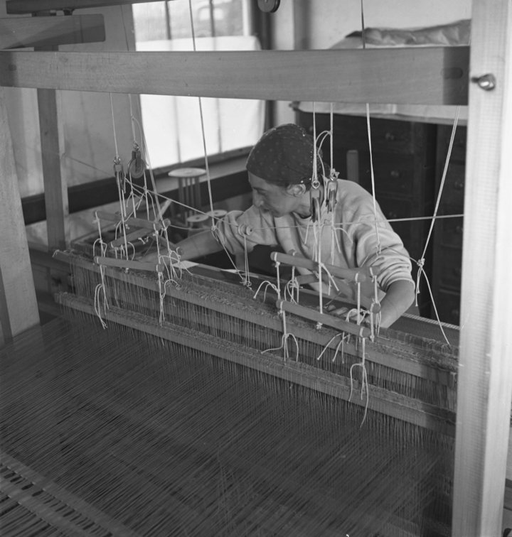
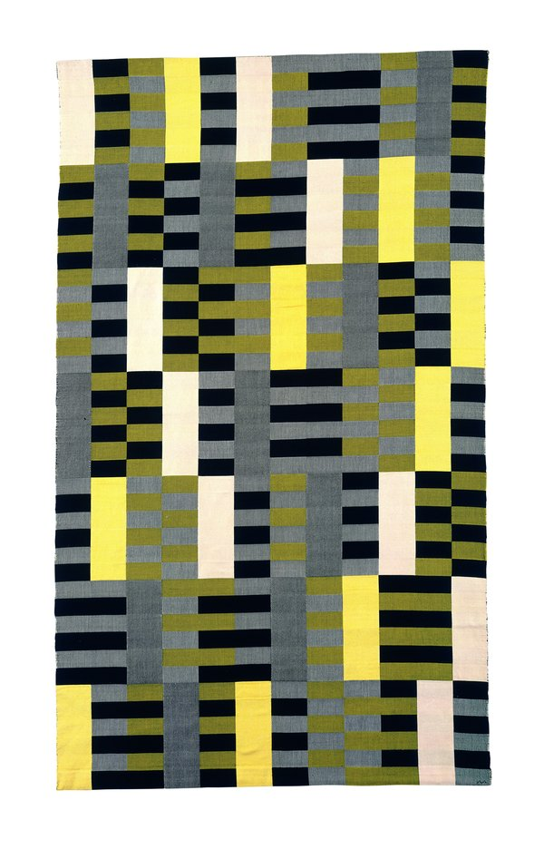
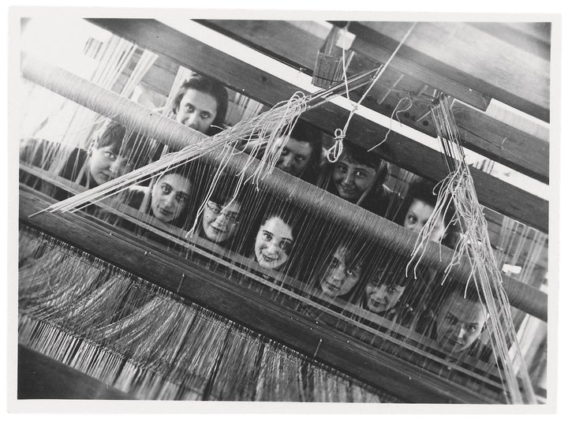
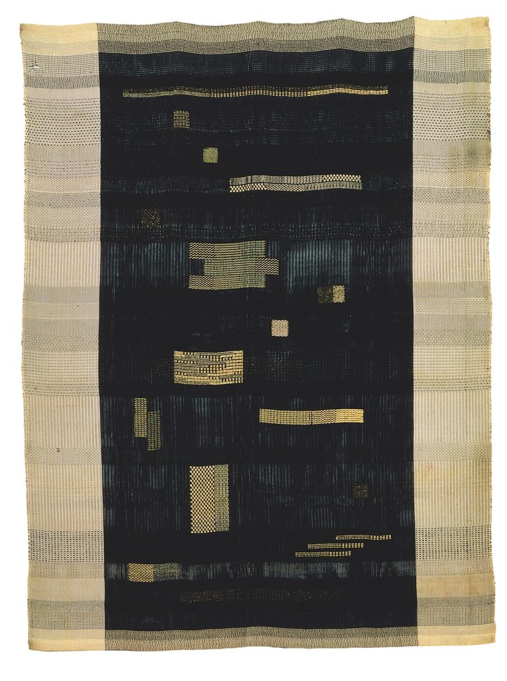
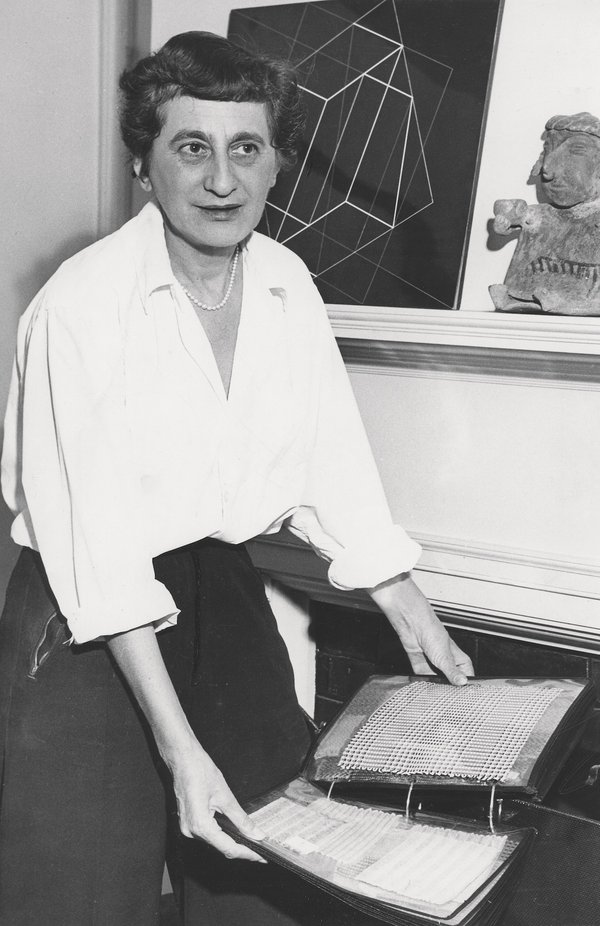
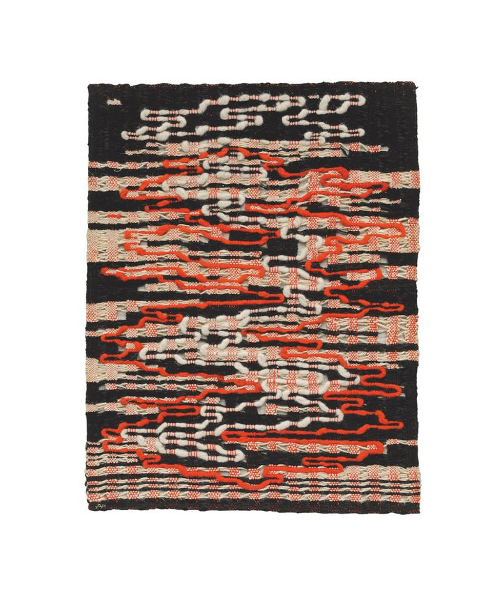

 
# Weaving Magic
 
<h2>One more
 
views on
 
Anni Albers
 
work.</h2>
--------
 
 
 
 
 
 
 
 
 
 
 
 
 
 
 
 
 
 

 Source
 
© 2019 The Josef and Anni Albers Foundation
TATE Collection 

## Upcoming exhibitions

 <b> 2019 Chicago </b>
 
Art Institute of Chicago,
Weaving beyond the Bauhaus,
3 August 2019–16 February 2020
 

 <b> 2019 Tucson, Arizona </b>
 
University of Arizona Museum of Art,
A New Unity: The Life and Afterlife of Bauhaus,
31 August–1 December 2019
 

 <b> 2019 Chicago </b>
 
Art Institute of Chicago,
In a Cloud, in a Wall, in a Chair: Six Modernists in Mexico at Midcentury,
5 September 2019–12 January 2020
 

 <b> 2019 New York </b>
 
David Zwirner Gallery,
Anni Albers,
10 September–19 October 2019
 

 <b> 2019 New York </b>
 
Museum of Modern Art,
Taking a Thread for a Walk,
21 October 2019–1 July 2020
 

 <b> 2019 Krefeld, Germany </b>
 
Kaiser Wilhelm Museum,
Folklore and Avant-Garde: The Reception of Popular Traditions in the Age of Modernism,
10 November 2019–23 February 2020
 

 <b> 2020 Paris </b>
 
Musée d'Art Moderne de la Ville de Paris,
Josef and Anni Albers: Constructions Parallèles,
9 October 2020–21 February 2021 

 
 
 
 
 
 
 
 
 
 
 
 
 
 
 
 
 
 
 
 
 
 
 
# Hello! I'm Anni Albers
 
## Have you ever heard about me?
 
 

 As a student at the Bauhaus in Germany in the early 1920s, Anni Albers found artistic freedom in the weaving workshop, where she began to explore the technical limits of fibres and the loom as a means of expression and experimentation. Albers pioneered a tactile approach to abstraction and modernist design, and her subsequent career as an artist and teacher has had a far-reaching legacy. 

 Anni Albers in her weaving studio at Black Mountain College, 1937, photographed by Helen M. Post Courtesy the Western Regional Archives, State Archives of North Carolina 

 How to make work that is a humane and organic part of a specifically modern pattern of life: that is one of the key questions that has driven modern artists to do what they do, irrespective of the medium they have chosen to work in. Anni Albers (1899–1994) was a weaver who not only engaged with the question, but most of all, made it matter. She wasn’t the first artist and designer to treat textiles as central to an ethical modern practice – think of William Morris in England – but she was certainly one of the most important weavers of the 20th century to think through a textile imaginary.

Her body of work is not vast – weaving is a very slow process and her output was relatively small compared to other artists, not least to the hundreds of Homages to the Square famously produced by her husband Josef Albers. But there are several factors that make her work seem particularly timely and that resonate in today’s digitised world of instant screen time: such as the slow time of hand-loom weaving and the strong affective sense of the weaver’s hand and touch. As Anni Albers put it, weaving offered ‘ways to regain sensitivity towards textile surfaces: texture’ which also suggests a means to regain a connectedness to a bodily and corporeal existence. ‘Sensitising’ the forms of geometric abstraction in this way is one of her most striking achievements, spanning a long career from the 1920s through to her late commission for a wall hanging in an iconic modernist hotel in Mexico City in 1968. 

 Anni Albers, Black and White 1926, re-woven by Gunta Stölzl 1965, cotton and silk, 203.8 x 120.3 cm 

 Anni Albers entered the Bauhaus as a student in 1922. Most women at the Bauhaus joined the weaving workshop and it’s fair to say that, although determined by their gender, they turned what might be conceived of as a constraint to an advantage. The remarkable group of women weavers – also including Gunta Stölzl, who would come to lead it, Otti Berger and others – formed an intense critical mass in the school, developing a sophisticated modern theory of weaving that both extended the remit of Bauhaus modernism and also, with hindsight, can be seen to have represented an alternative trajectory to it. Weaving, for Albers certainly, offered a way to bridge the divide between art and design, not by opting for either one in preference to the other, but in working with both in tandem – making abstract wall hangings that she saw as artworks like the paintings of Klee and Kandinsky at the same time that she was designing things for use, such as wall coverings, fabrics or rugs. Her diploma piece at the Bauhaus was a sound-proofing fabric to improve the acoustics of Hannes Meyer’s auditorium for a nearby trade union school. Throughout her life she thought about the relationship between what she would later call her ‘pictorial weavings’ that hung on the wall and her work designing for machine production. 

 Group portrait of the weavers in the Bauhaus workshop, 1928 (Anni Albers is in the bottom row, second from left).
Bauhaus-Archive, Berlin 

 The Albers left Germany for the United States in 1933 as part of the seismic migrations of peoples escaping the rise of Nazism during that decade. Anni Albers was Jewish and finally managed to help her parents escape in 1939, meeting them off the boat in Veracruz in Mexico. Following the closure of the Bauhaus by the authorities, many of the most prominent faculty moved to America – including Walter Gropius, Marcel Breuer, Mies van der Rohe, Lázló Moholy-Nagy as well as the Albers – where they became the key protagonists in what has been called the ‘Americanisation’ of the Bauhaus. Although they all ended up in different places – the Albers at Black Mountain College in North Carolina, Moholy-Nagy at the new Bauhaus in Chicago, Gropius at Harvard – their modernist aesthetic would become embedded in art and design education in ways that are hard to overestimate and not always what one might have expected. In the work of students who studied at Black Mountain – such as Robert Rauschenberg, Ruth Asawa, and others who were not even directly taught by her – one can see the impact of Anni Albers’s interests in interwoven layers of textiles or the interlaced threads of their structure.
Looking at Albers’s work as a kind of cross-section rather than a linear progression – from teaching exercises and wall hung weavings to textiles for architectural projects – it’s the sheer adaptability of the medium that stands out. Each work is made with its purpose clearly in mind, but each also demonstrates the elasticity of weaving in adapting to different needs. So much so, that weaving becomes more than a medium – say, like painting – and much more expansive, much more structurally embedded in its environment. In this regard, weaving’s ancient history is not a hindrance but a foundation for supposing a proximity between weaving and architecture, with the textile as the first or original wall (an old idea in architectural theory). Anni Albers certainly liked to draw on these ideas about the nomadic and the portable that traced a history of textiles back to basic needs for clothing to protect us and tents to shelter us. But weaving is also much more than proxy architecture for her: it gave her an abstract lexicon to work with based on the grid. Our modern obsession with the grid, since Mondrian and Klee, now looks – at least when we think about weaving – to have a very ancient history indeed. As such it offers us an object lesson in how to think about a much more global history of modernist abstraction than we are used to. 

 Anni Albers, Ancient Writing 1936, cotton and rayon, 150.5 x 111.8 cm 

 The grid of all woven fabrics is something we take entirely for granted. Yet it existed thousands of years before the moderns made the grid their typical, paradigmatic form. A weaver always has to think structurally rather than simply formally about the patterns that appear on the surface of a design. The loom is one of our earliest technologies and many of the most sophisticated woven textiles date back to much earlier civilisations, such as those of the Andean peoples. Anni Albers spent a lifetime exploring the work of the Latin American weavers, especially the Peruvians, collecting examples of their work on the couple’s many travels. Almost as soon as they were able to, the Albers travelled south from their base at Black Mountain College to Mexico for long summers – as well as to Cuba and later to Chile and Peru. Anni Albers would learn how to use backstrap looms – some of the very earliest looms still being used by contemporary weavers – and go on to teach her students the techniques she had acquired, including learning by unravelling small samples that she had bought in order to see how they were made. 

 Anni Albers with textile samples in her home in New Haven, c.1950–60, photographed for the New Haven Register

Courtesy the Josef and Anni Albers Foundation 

 After she moved to New Haven in 1950, when Josef Albers took up a position at Yale University, she even took a class at Yale with the great scholar of pre-Columbian art, George Kubler. Her own erudite and lucid book On Weaving, published in 1965, would become a landmark text – not only as a survey of world weaving but also as a powerful set of claims for the ongoing validity of tactility and a haptic sense of the world for contemporary life. If Kubler’s methods might have helped Anni Albers think about modernity in terms of its ancient rather than recent past, then Anni Albers’s own work as a weaver and the example of weaving as a process surely offers an even more powerful set of claims for the different kinds of temporal duration that Kubler was interested in. He would address these themes in The Shape of Time: Remarks on a History of Things, his 1962 classic that looked at art history not through a chronology of styles but by cutting across media in terms of series and sequences. Understanding a making process in terms of slow (hand-loom) and fast (machine-loom) weaving had, since her Bauhaus days, underpinned Albers’s thinking about the often contradictory demands on making, and of the maker, in the modern era.

There is a striking symmetry between her collection of pre-Columbian fragments and her own large archive of textile samples. One collection is of tiny scraps cut from larger textiles, showing often-intricate geometric designs gathered from her travels in Latin America; the other is a collection of modern textile samples for work that she may or may not have gone on to put into production. They are all hand-scaled, intimate artefacts – either small patches that have been extracted and saved, or trial pieces for projects to be done in the future. The groups of her samples acquired by collections of modern design (given by the artist as well as purchased by museums such as the Cooper Hewitt, Smithsonian Design Museum in New York), as well as those she kept herself and which remain in the Albers Collection in Connecticut, are testament to the fact that samples or fragments of both kinds were part of an elaborate system of distribution and exchange – one that ranged from gifts to collectibles through to the sharing of technical and other kinds of knowledge between cultures.

I don’t think the Albers’s collecting habit (because this was definitely a shared operation) can be described simply as a primitivist appropriation of ancient tecñiques from faraway places. It is not, that is, the kind of problematic overcoming of cultural difference that the Marxist art historian Meyer Schapiro once rounded on as the presumption that ‘the art of the whole world was now available on a single unhistorical and universal plane as a panorama of the formalising energies of man’, as if world culture were simply servile to what we could see as a colonial imagination dictating the geometric dogmas of modern art. Certainly, despite Anni Albers’s extensive knowledge about the weaving cultures of the world, and especially Latin America, her choices were mainly aesthetic rather than academic or scholarly. And yet what we must understand by aesthetic, in this instance, is much more than a narrowly formalist category but a sense of an aesthetic that is fundamentally structural, and structurally material and haptic – rather than one based on gathering similar forms and shapes just because of their superficial likeness. 

 As the geometric designs of weaving in older cultures show, abstract patterns can express complex belief systems and social attitudes. Likewise, we can also see weaving in the modern idiom as a vehicle to articulate the kinds of relationships we have to the forms and materials of life. For example, Anni Albers’s work – both the handwoven wall hangings and the one-off pictorial weavings that she made, through to her designs for machine production – embodies a commitment to experimental mixtures of synthetic and natural yarns and fibres. Even in her Bauhaus work, she was incorporating newly invented cellophane and would continue to do so in increasingly bold and striking ways. She made a group of room dividers for her 1949 exhibition at the Museum of Modern Art (MoMA) in New York, as well as samples for others, in which she characteristically combined materials as diverse as cellophane, horsehair, cotton and jute. In some of the experimental samples she made at this time for similar open weaves it is possible to see the interweaving of different textures that seems at first unremarkable, but which, as you look, is revealed to be more and more intricate and unexpected. These material juxtapositions are as innovative as the idea of the screens themselves, which Albers developed as prototypes for adaptable partitions in response to developments in modernist architecture, such as open-plan spaces and large glass windows. 

 Anni Albers, Under Way 1963, cotton, linen and wool, 73.8 x 61.3 cm 

 When Anni Albers published her collection of essays On Designing in 1959 the architect Buckminster Fuller wrote the blurb for her. He enthusiastically praised the planar compositions of her fabrics, drawing attention to the intersection between the apparatus of the loom and the spaces of modern experience, which seemed to him like the criss-cross grids of Earth’s cities seen from above, or: ‘Seen from inside the city streets or within the loom, both cities and fabrics disclose multi-dimensional structuring of great complexity.’ Her relationship to architecture, though it has been overlooked, was a vital strand in her practice. Even though she didn’t hold a formal teaching position at Yale, she gave informal lectures in the architecture department. True to her Bauhaus roots, as well as to older ideas of the proximity of weaving and architecture, she developed the idea of the ‘pliable plane’, which made clear that a textile was both fundamentally structural and endlessly mutable and responsive to its setting. Rather than a minority interest, weaving, as Anni Albers envisaged it, was a way for the making process to be an expression of modern life, not a retreat from it. 

 <i> Anni Albers, curated by Ann Coxon, Curator, International Art, Tate Modern and Briony Fer, with Maria Müller-Schareck, Curator, Stiftung Kunstsammlung Nordrhein-Westfalen; supported by the Terra Foundation for American Art, with additional support from the Anni Albers Exhibition Supporters Circle and Tate Patrons; The Eyal Ofer Galleries, Tate Modern, 11 October – 27 January 2019. </i> 

 
 
 
 
 
 
 
 
 
 
 
 
 
 
 

 Emma Zerial
 
Hochschule der Bildenden Künste Saar
 
SoSe 2019
 
Code is Cool Workshop, by Jacob Heftmann 

